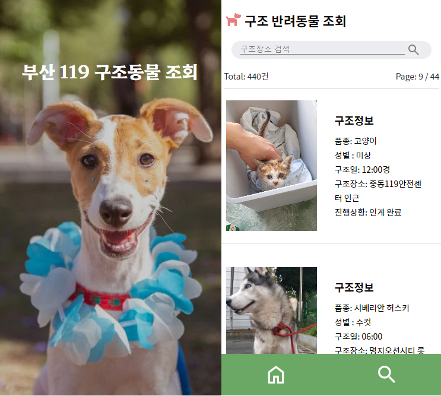

<h1>부산 119 구조 반려동물 조회</h1>

Demo:https://web-animal-rescue119-3a9t2bldtzerfu.sel3.cloudtype.app/

<h2>Stack</h2>

 
<h2>Tool</h2>

 
  <h2>Screenshot</h2>
  
<h2>Before update</h2>
<ul>
 <li>공공 API의 데이터를 불러오기</li>
 <li>개별 데이터로 보여줄 Item 컴퍼넌트 추가</li>
<li>map 반복문으로 Item 출력</li>
 </ul> 
<h2>After update</h2>
  <ul>
    
    <h3>upState 함수로 초기값 설정</h3>
    <li>총 게시글 수 설정</li>
    <li>페이지 번호(1) 설정</li>
    <li>화면 당 글 수(10개) 설정</li>
     
    
    <li>이전/다음 페이지 설정</li>
     
    
    <li>Items 컴포넌트 자료 가져올 때 속도가 느릴 수 있어서 '로딩 중'이라고 표시</li>
  </ul>
  

